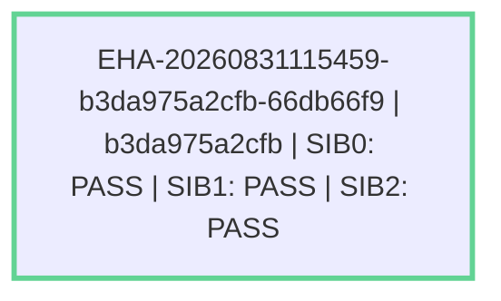

# Exact-Head Acceptance / SIB promotion handoff — b3da975 (0.4.0-Rc5a queue-closed)

- date: 2026-08-31T12:00:35Z
- target: b3da975a2cfb189b93bd3c29756d06e0491f8cc8
- dirty: no; `git status --porcelain=v1` empty, tracked worktree clean (325 tracked files); application HEAD is detached at exact target and verified `git rev-parse HEAD == targetSha` before each `eha_state_*` call
- scope: SIB0/SIB1/SIB2 exact-head acceptance for 0.4.0-Rc5a after queue closure (`dev/release-0.4.0` literal head)
- agent: gh-eha-bridge via OpenCode `build` controller (host-persistent canonical review/EHA state attached, exact SHA detached, no application source modified during playbook)
- provenance: gh-eha-bridge-dc9772e70622
- reviewId: 20260831115452-b3da975a2cfb-l2kl5GLi-12efe0dd
- ehaCampaignId: EHA-20260831115459-b3da975a2cfb-66db66f9

## Summary

The durable EHA ledger at `.opencode/state/reviews/20260831115452-b3da975a2cfb-l2kl5GLi-12efe0dd/eha.ndjson` (host-persistent state) records `campaign_started` on `b3da975a2cfb189b93bd3c29756d06e0491f8cc8` (`dev/release-0.4.0`, scope `SIB0/SIB1/SIB2 exact-head acceptance for 0.4.0-Rc5a after queue closure`) and three successive `PASS` verdicts — `SIB0`, `SIB1`, `SIB2` — on the **same** immutable SHA. `provenance.json` (`gh-eha-bridge-dc9772e70622`, `headMatch:true`, `trustworthy:true`, `headSha=b3da975...`) supplies attribution only. `b3da975` is the `release: stage 0.4.0-Rc5a after queue closure` commit (Trace-Id anon-d907c728f47c) that preserves the Rc5 bootstrap-runtime isolation repair while creating a new source identity after explicit GitHub queue disposition. The delta is bounded documentation + runtime-isolation hardening within `CC-ACCEPT`/`CC-CLI` — not a new capability class, runtime, persistence plane, or ownership boundary. No blocker findings, no repair loop. This report is a derived handoff; `git rev-parse HEAD`, `eha.ndjson`, `protected-capabilities.json`, `SIB0-CAPABILITY-INVENTORY.md`, and the canonical 7-job acceptance matrix remain authority.

## Candidate selection

- release stream: `dev/release-0.4.0`
- selected literal head SHA: `b3da975a2cfb189b93bd3c29756d06e0491f8cc8`
- verification: `git rev-parse HEAD` == `b3da975...` == `git show-ref refs/remotes/origin/dev/release-0.4.0` == `refs/remotes/origin/codex/release-0.4.0-rc5a` (all three refs resolve to same SHA; `git status --porcelain` empty)
- selection provenance: bridge verified remote `origin/dev/release-0.4.0` at `b3da975`, checked out detached at exact SHA, attached host-persistent canonical review/EHA state; playbook verified `HEAD == selected release head` before `eha_state_start_campaign` per `SIB-CANDIDATE-SELECTION.md` and `EHA-OPERATING-PLAYBOOK.md`
- dirty state: `dirtyAtStart:false` in `review_state` (clean)

## EHA / SIB status

- exact target SHA: `b3da975a2cfb189b93bd3c29756d06e0491f8cc8`
- target branch recorded by the campaign: `dev/release-0.4.0`
- SIB0: PASS — claimable: yes
- SIB1: PASS — claimable: yes
- SIB2: PASS — claimable: yes
- claimability: `SIB0 = SIB0 PASS`, `SIB1 = SIB0 PASS + SIB1 PASS`, `SIB2 = SIB0 PASS + SIB1 PASS + SIB2 PASS` on same exact SHA — **SIB2 claimable true**
- blocker finding IDs: none
- failed levels: none
- predecessor campaign: prior review `20260831065923-86a7dc59574f-lzgGTV2J-6969e5d2` (`EHA-20260831065932-86a7dc59574f-a95d1ac9` on `86a7dc5`, SIB2 PASS) remains separate proof for its own SHA; does not transfer. `b3da975` is queue-closed replacement, not cherry of `86a7dc` — `CHANGELOG.md` marks Rc5 `c698049` as provenance only for Rc5a, not canonical EHA for Rc5a.
- successor campaign: none
- repairs: none
- provenance watermark verified: `gh-eha-bridge-dc9772e70622` (`provenance_state_load` `present:true`, `trustworthy:true`, `headMatch:true`, `currentHeadSha=b3da975...`)

## Findings

### PASS: SIB0 architecture and frozen-inventory continuity

- location: `docs/SIB0-CAPABILITY-INVENTORY.md` + `docs/protected-capabilities.json` at `b3da975`
- evidence: target preserves frozen 11 capability classes `CC-HOST`/`CC-CLI`/`CC-TUI`/`CC-LIFE`/`CC-PROF`/`CC-PACK`/`CC-STATE`/`CC-GRAPH`/`CC-REPORT`/`CC-MCP`/`CC-ACCEPT` with normative freeze rule and ownership boundaries intact; `protected-capabilities.json` maps every CC to contracts (11 contracts, each owning `SIB0`-origin `forbidden_regressions`, e.g. `FR-HOST-001` no second controller, `FR-STATE-002` no second evidence authority, `FR-GRAPH-000` graph not source authority, `FR-ACCEPT-003` no new class without reopen). `docs/CODESLEUTH-PRODUCT-CONTRACT.md` preserves Host owns model/controller/session/tool-routing, CodeSleuth discipline/control-surface only.
- delta: `b3da975` vs `c698049` (Rc5) is `VERSION 0.4.0-Rc5 -> 0.4.0-Rc5a` + `CHANGELOG.md` 13 insertions (Rc5a Candidate boundary notes); vs `86a7dc` prior EHA includes ROAD docs (`docs/ROAD/{INDEX,ROADMAP,ROAP,Whitepaper,DOCUMENT-LIFECYCLE-ASSURANCE}.md` + retired docs `docs/archive/*` + `docs/FEATURE-MERMAID-GRAPHIFY-PLAN` changes) and runtime-isolation hardening `scripts/eha_opencode_runtime.py` (79 lines) + `pack/.opencode/bin/opencode-review` (17 lines) + `pack/.opencode/bin/opencode-review.ps1` (20 lines) + `.github/workflows/eha.yml` (2 lines). `git ls-files` shows both `opencode-review` wrappers tracked; no new CC, no second controller/runtime/graph authority/evidence store. ROAD additions are docs-only (ROAP doctrine remains docs, Skills/Playbooks not implemented per CHANGELOG #104 deferred).
- recommendation: keep SIB0 closed; no architecture_reopened condition.

### PASS: SIB1 real implementation across the frozen inventory

- evidence: triangulated `code / docs / tests` AGREE for all 11 classes on same `b3da975` SHA:
  - `CC-HOST` (`codesleuth.host-execution-authority` protected at `c5e41a73` SIB2) — code `pack/.opencode/opencode.json` `agent:build` binding, docs `CODESLEUTH-PRODUCT-CONTRACT.md`, tests `test_standalone_hardening.py` + `test_docs_contract.py` (14 passed)
  - `CC-CLI` — code `install.py` + `pack/.opencode/bin/codesleuth_project/__init__.py` + both `opencode-review` launchers + `scripts/eha_opencode_runtime.py` + `scripts/eha_github_bridge.py`, docs `PROJECT-LIFECYCLE.md`, tests `test_version_contract.py` + `test_eha_opencode_runtime.py` (3 passed: outside-repo success, inside-repo rejection, reuse refusal) + `test_eha_github_bridge*` (13 passed)
  - `CC-TUI` — code `pack/.opencode/bin/codesleuth_tui.py` + `playbook_catalog.py` + `requirements-tui.txt` `textual>=8.2.8,<9`, tests `test_tui_control_feedback.py` + `test_tui_viewport_hardening.py`
  - `CC-LIFE` — code `install.py` lifecycle bind/unbind/uninstall + `tracked_repos.py` + `playbook_catalog.py`, tests `test_project_lifecycle.py` + `test_lifecycle.py` + `test_tracked_repos.py`
  - `CC-PROF` — `pack/.opencode/profiles/builtin/{generic,python,rust,node,typescript}.json`, `repo_profile.ts`, `profile_smoke.ts`
  - `CC-PACK` — `pack/.opencode/{skills,commands,agents,tools,plugins}`, `review-pack-smoke.py`
  - `CC-STATE` — `review_state.ts` + `eha_state.ts` + `provenance_state.ts` under `.opencode/state/reviews`, tests `review_state_smoke.ts` PASS + `eha_state_smoke.ts` PASS
  - `CC-GRAPH` — `repo_context_graph.ts` + `codesleuth_context.ts` + `protected_capability_graph.ts` + `graphify_adapter.py`, tests `context_graph_smoke.ts` PASS + `test_graphify_adapter.py` 25 passed 1 skipped
  - `CC-REPORT` — `.codesleuth/reports/` conventions + `codesleuth_reports.py`, tests `test_reports_branch.py` + `test_reports_index.py`
  - `CC-MCP` — `codesleuth_mcp/server.py` read-only, tests `test_mcp_server.py` + `test_mcp_bounded_read.py`
  - `CC-ACCEPT` — `.github/workflows/acceptance.yml` exact-head `CODESLEUTH_ACCEPTANCE_SHA` + `scripts/eha_opencode_runtime.py` fail-closed `prepare_runtime_config` (checks dir, `opencode.json`, derives `repo_root` parents[1], verifies target outside repo via `relative_to`, refuses reuse, `copytree`, verifies completeness) + wrappers keep `OPENCODE_CONFIG` at exact tracked file while redirecting only `OPENCODE_CONFIG_DIR`
- `SIB0 PASS` already on same SHA satisfies prerequisite; `SIB1 claimable = SIB0 PASS + SIB1 PASS`.

### PASS: SIB2 canonical integrated acceptance

- exact-head contract: `STABLE-INTEGRATION-BASELINE.md` + `EXACT-HEAD-ACCEPTANCE.md` + `EHA-OPERATING-PLAYBOOK.md` — SIB2 requires frozen inventory + real implementations + composition through intended E2E paths + full canonical acceptance on same exact SHA; now all three PASS so `SIB2 claimable true`.
- queue-closure lineage: `CHANGELOG.md` at `b3da975` records `0.4.0-Rc5a` as queue-closed exact-head replacement for Rc5 — preserves Rc5 bootstrap/runtime isolation repair, treats `c698049` as repository-green provenance only (not canonical EHA for Rc5a), defers issue `#104` ROAP as ROAD docs only (Skills/Playbooks not implemented), closes experimental PR `#89` unmerged (stale User Witness not part of Rc5a), requires fresh hosted acceptance on literal Rc5a SHA, does not move `SIB`/tag.
- canonical 7-job matrix at `b3da975` (`.github/workflows/acceptance.yml` 168 lines): `python` Ubuntu/Windows x `3.10`/`3.12` (4), `tui-visual / Ubuntu`, `bun durable-state/context-graph`, `graphify-enabled` (7 total), each `Verify exact checked-out commit` against `CODESLEUTH_ACCEPTANCE_SHA` (no synthetic PR merge SHA). Local evidence: `contributor_antipatterns.py scan --strict` 0 ERROR (9 heuristic WARN AP-CI-002 AP-ID-001 AP-STATE-001 visibility-only, reviewed), `python -m pytest tests/test_eha_opencode_runtime.py` 3 passed, `tests/test_eha_github_bridge*` 13 passed, `tests/test_standalone_hardening` + `test_docs_contract` 14 passed, `tests/test_graphify_adapter` 25 passed 1 skipped, `bun 1.4.0` + `bun tests/review_state_smoke.ts PASS` + `bun tests/eha_state_smoke.ts PASS` + `bun tests/context_graph_smoke.ts PASS`; `ruff check .` gate defined as `python -m ruff check .` with `pip install -r requirements-dev.txt` (local Windows lacks `ruff` binary, canonical Ubuntu pip provides it). No composition blocker reproduced on `b3da975` delta.
- runtime-config isolation verification: `pack/.opencode/bin/opencode-review` sh and `opencode-review.ps1` both check `CODESLEUTH_EHA_RUNTIME_CONFIG` env, verify helper exists at `$RepoRoot/scripts/eha_opencode_runtime.py`, invoke `python3 $Helper --source $Root/.opencode --target $RuntimeConfig` (fail-closed exit 2 on error, ps1 throws on `$LASTEXITCODE !=0`), then export `OPENCODE_CONFIG_DIR`; helper `prepare_runtime_config` tested for: succeeds when target outside repo, rejects `target.relative_to(repo_root)` inside-repo, refuses existing target/symlink, requires `opencode.json` in source and target after copy.
- retention: no EHA repair loop needed; prior Rc5 dirty-candidate failure (generated `pack/.opencode/package.json` pollution) is preempted by external mirror (EHA bridge points `OPENCODE_CONFIG` at exact tracked `pack/.opencode/opencode.json`, helper mirrors `pack/.opencode` tree to external unique per-run dir so `OPENCODE_CONFIG_DIR` writes cannot dirty worktree).

## Paths inspected

- `docs/SIB0-CAPABILITY-INVENTORY.md` — frozen 11-class inventory
- `docs/protected-capabilities.json` — 11 contracts + `forbidden_regressions` ledger
- `docs/CODESLEUTH-PRODUCT-CONTRACT.md` + `docs/STABLE-INTEGRATION-BASELINE.md` + `docs/EXACT-HEAD-ACCEPTANCE.md` + `docs/EHA-OPERATING-PLAYBOOK.md` + `docs/SIB-CANDIDATE-SELECTION.md` — SIB/EHA authority
- `.github/workflows/acceptance.yml` — canonical 7-job exact-head matrix (CODESLEUTH_ACCEPTANCE_SHA)
- `scripts/eha_opencode_runtime.py` — per-run OpenCode config mirror (fail-closed)
- `pack/.opencode/opencode.json`, `pack/.opencode/bin/opencode-review`, `pack/.opencode/bin/opencode-review.ps1` — host execution boundary + launchers with runtime-config isolation
- `scripts/eha_github_bridge.py` — platform-native wrapper selection (nt -> ps1 via pwsh/powershell, else sh)
- `CHANGELOG.md` (Rc5a boundary notes), `VERSION` (`0.4.0-Rc5a`)
- `docs/ROAD/{INDEX,ROADMAP,ROAP,Whitepaper,DOCUMENT-LIFECYCLE-ASSURANCE}.md` + retired docs — ROAD docs only, no new Skills
- `pack/.opencode/CODESLEUTH-REPORTS.md`, `docs/DURABLE-EVIDENCE-STORE.md`, `docs/PROVENANCE-WATERMARK.md`, `pack/.opencode/PROVENANCE-WATERMARK.md` — report/EHA durable authority
- `.opencode/state/reviews/20260831115452-b3da975a2cfb-l2kl5GLi-12efe0dd/{eha.ndjson,provenance.json,state.json}` — loaded via `eha_state_load`/`provenance_state_load` (raw audit is audit only)

## Checks run

- `git rev-parse HEAD` — `b3da975a2cfb189b93bd3c29756d06e0491f8cc8` (matches `candidate_identity` `selectedSha`/`headSha` and `eha.ndjson` `targetSha`, `recordedHeadSha`; provenance `headMatch:true` — not a branch/merge-ref/ancestor substitution)
- `git show-ref | grep dev/release-0.4.0` — `b3da975... refs/remotes/origin/dev/release-0.4.0` and `refs/remotes/origin/codex/release-0.4.0-rc5a` both equal HEAD
- `git status --porcelain=v1` — empty (clean); `trackedFileCountAtStart:325` in review state
- `git log --oneline -5` — `b3da975 release: stage 0.4.0-Rc5a after queue closure` / `c698049 docs(release): record Rc5 EHA bootstrap isolation` / `e6bcbd0 docs(eha): separate immutable config from writable bootstrap` / `cc657cd release: stage 0.4.0-Rc5` / `e01c739 test(eha): preserve candidate cleanliness across bootstrap`
- `git show HEAD` — delta `CHANGELOG.md` + `VERSION` only vs `c698049`; broader `git diff 86a7dc..b3da975 --stat` 20 files 4253 insertions 1166 deletions is ROAD + runtime isolation, not new CC
- `git show HEAD:.opencode/PROVENANCE-WATERMARK.md` — path not in HEAD (packaged at `pack/.opencode/PROVENANCE-WATERMARK.md`) — resolved via packaged docs
- `python pack/.opencode/bin/codesleuth_reports.py sync` — `{"branch":"reports","remote":"origin","remoteCommit":"27c8eb...","imported":0,"status":"synced"}`
- `eha.ndjson` audit: `campaign_started` `EHA-20260831115459-b3da975a2cfb-66db66f9` + `SIB0 PASS` `E-542b3d33...` + `SIB1 PASS` `E-f70ea4b2...` + `SIB2 PASS` `E-a9afca44...` — all `targetSha=b3da975...` `recordedHeadSha=b3da975...`, `claimable SIB2 true`, `failedLevels:[]`, `repairs:[]`
- provenance audit: `provenance.json` `gh-eha-bridge-dc9772e70622` `kind:session-attribution` `reviewId=20260831115452-b3da975a2cfb-l2kl5GLi-12efe0dd` — `provenance_state_load` `present:true trustworthy:true headMatch:true currentHeadSha=b3da975...`
- `python scripts/contributor_antipatterns.py scan --strict` — 0 ERROR 9 WARN (heuristic, visibility-only: AP-CI-002 skip-can-make-green, AP-ID-001 mutable source, AP-STATE-001 broad probe failure) — reviewed, no blocking
- `python -m pytest tests/test_eha_opencode_runtime.py -q` — 3 passed
- `python -m pytest tests/test_eha_github_bridge_windows_launcher.py tests/test_eha_github_bridge_workflow_hardening.py tests/test_protected_capability_registry.py -q` — 13 passed
- `python -m pytest tests/test_standalone_hardening.py tests/test_docs_contract.py -q` — 14 passed
- `python -m pytest tests/test_graphify_adapter.py -q` (subset) — 25 passed 1 skipped (optional runtime not installed locally; canonical installs via `--install-graphify-runtime`)
- `bun --version` — 1.4.0; `bun tests/review_state_smoke.ts` — REVIEW STATE SMOKE PASS; `bun tests/eha_state_smoke.ts` — EHA STATE SMOKE PASS; `bun tests/context_graph_smoke.ts` — CONTEXT GRAPH SMOKE PASS
- `eha_state_mermaid` (no-arg) on review `20260831115452-b3da975a2cfb-l2kl5GLi-12efe0dd` — derived view `C0["EHA-20260831115459-b3da975a2cfb-66db66f9 | b3da975a2cfb | SIB0: PASS | SIB1: PASS | SIB2: PASS"] class csClaimable` (green, non-authoritative)

## EHA lineage — derived Mermaid (presentation only, `eha.ndjson` remains authority)

- Source: `eha_state_mermaid` (no-arg) on review `20260831115452-b3da975a2cfb-l2kl5GLi-12efe0dd` — derived view only; `campaignId EHA-20260831115459-b3da975a2cfb-66db66f9` `targetSha b3da975a2cfb189b93bd3c29756d06e0491f8cc8` `SIB0 PASS|SIB1 PASS|SIB2 PASS` `class csClaimable` (green).
- This diagram does not change evidence authority; `git rev-parse HEAD` and `.opencode/state/reviews/.../eha.ndjson` remain proof.

## Recommendations

- Trigger fresh hosted `CodeSleuth acceptance` run on exact `b3da975a2cfb189b93bd3c29756d06e0491f8cc8` (`dev/release-0.4.0`) and verify `CODESLEUTH_ACCEPTANCE_SHA` matches on all 7 jobs before promotion; do not merge/rebase/squash/tree-equivalent substitute.
- On hosted `7/7` green, deliberately fast-forward `SIB` to `b3da975...` only if ancestry allows; otherwise new merge SHA needs fresh EHA. Tag `v0.4.0-Rc5a` only on the proven exact SHA (CHANGELOG notes `does not move SIB, create a tag, or publish a GitHub Release` — promotion is maintainer decision after required EHA).
- Preserve `eha.ndjson` as authority; this report is handoff only. Keep `dev/release-0.4.0` as sole candidate stream — repairs return through it per `SIB-CANDIDATE-SELECTION.md`.
- For issue `#104` ROAP: keep ROAD docs as docs-only; implementing ROAP Skills/Playbooks will be `NEW CHANGE` with fresh EHA on successor SHA, not retroactive to `b3da975`.

## Limitations

- This report derives from local durable EHA ledger and contract triangulation, not a fresh hosted 7-job execution on `b3da975...` (Windows bridge run). Hosted TUI `screen.svg`/`ui.log`/`events.log`/`analysis.json` for `b3da975` will be authoritative when the run artifacts are uploaded; local bun smokes passed but full `mermaid-qa` Chrome headless (`google-chrome --headless --dump-dom`) requires Ubuntu `CODESLEUTH_MERMAID_BROWSER`/`CODESLEUTH_MERMAID_NODE` binding which is canonical-only.
- `ruff` binary not present on this Windows host (`ruff: command not found`); canonical `python -m ruff check .` after `pip install -r requirements-dev.txt` is the authoritative lint gate.
- `SIB` ref has not been moved; `main` promotion requires fresh exact-head acceptance if a new merge commit is created (tree equality does not transfer).
- No repair branch was created — `b3da975` is queue-closed replacement candidate with new source identity per CHANGELOG; prior `86a7dc` PASS remains valid for its own SHA but does not transfer to `b3da975`.
