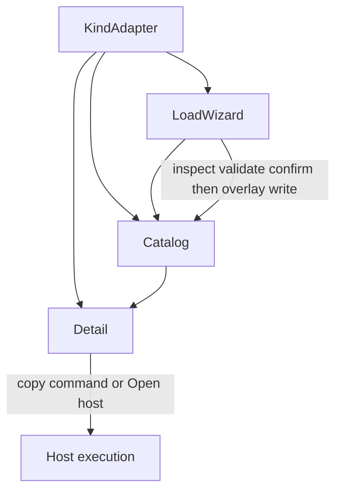

# Extension load units

**Status:** Normative composition contract for user-loadable pack content
**Classification:** feature population inside `CC-TUI` + `CC-PACK` + `CC-LIFE` (+ `CC-PROF` when the kind is a profile)
**SIB0:** not reopened. This is not a new capability class. It names the shared operator units already allowed by [`CODESLEUTH-PRODUCT-CONTRACT.md`](CODESLEUTH-PRODUCT-CONTRACT.md) §5–6.

Playbooks is the **first instance**. Later Skills, profiles, tools/plugins, and host adapters reuse the same units instead of inventing a second wizard family.

Execution after load remains host-native. These units never become a CodeSleuth runner, scheduler, marketplace, or general-purpose tool router.

## Why this is one capability-shaped unit

Every user-loadable configuration has the same operator job:

```text
see what is loaded
  -> inspect one item's details
  -> load another item through a wizard that cannot silently write or execute
```

If each kind (Playbook, Skill, profile, tool) grows its own unrelated UI, operators cannot transfer skill and implementers will duplicate unsafe install paths. The kind-specific payload changes; the units do not.

## Shared units



### 1. Kind adapter

Kind-specific slot. Shared units call it; they do not embed Playbook JSON, Skill YAML, or profile schema.

A kind adapter MUST declare:

| Field | Role |
| --- | --- |
| `kind_id` | stable id: `playbook`, later `skill`, `profile`, `tool`, `plugin`, `adapter` |
| `overlay_root` | target write/read path, e.g. `.opencode/playbooks/` |
| `pack_roots` | builtin/source catalogs that are not the overlay |
| `manifest_name` | file that identifies one item (`playbook.json`, later `SKILL.md`, …) |
| `validate(package)` | kind invariants; errors block install, warnings do not |
| `detail_model` | what Detail renders (steps/skills/tools for Playbooks) |
| `host_command(item)` | copyable route into the host, or none |
| `origin` | `pack` or `overlay` after merge |

A new kind is a new adapter, not a new wizard architecture.

### 2. Catalog

The loaded list. Mandatory for every kind that has a load wizard.

The catalog MUST:

- list overlay items and pack items in one table;
- let **overlay win** on the same id when content differs;
- show `id`, origin, and enough columns to choose a row (Playbooks: step count, `/playbook` or alias);
- treat each row as a control (not a log dump);
- open Detail on select;
- expose **Load** for that kind’s wizard.

The catalog MUST NOT execute the item.

First instance: Playbooks surface in [`pack/.opencode/bin/codesleuth_tui.py`](../pack/.opencode/bin/codesleuth_tui.py), discovery in [`pack/.opencode/bin/playbook_catalog.py`](../pack/.opencode/bin/playbook_catalog.py).

### 3. Detail

The selected loaded item. Mandatory next to Catalog.

Detail MUST show:

- identity, origin, overlay/pack path;
- kind-specific body (Playbooks: step DAG, `skill:` / `tool:` chips from the manifest);
- provenance that chips inspect contracts and **do not** invoke Skills or Tools;
- optional copy of `host_command` and Open host.

Detail is for the operator and for the model’s declared surface. It is not Step materialization.

At narrow viewports the catalog may hide so Detail fits; returning to Catalog must stay one control (surface button or Back). That is layout, not a different unit.

### 4. Load wizard

Shared phase machine. Kind adapters fill the slots; they do not skip phases.

```text
Source → Inspect → Validate → Confirm → Result
```

| Phase | Shared rule | Kind slot |
| --- | --- | --- |
| Source | local directory or zip in the first slice; remote URL is phase 2 | expected layout / manifest name |
| Inspect | show id, origin path, counts, referenced objects **before any write** | parsed record |
| Validate | hard errors block Continue; warnings remain visible | `validate(package)` |
| Confirm | overlay destination, overwrite/collision, “this is a file write, not host execute” | overlay path; pack-id collision requires explicit confirm or reject |
| Result | item now in Catalog; next operator action is the host command if any | no auto-`/playbook`, no auto-Skill load |

Abort/Escape on Source–Confirm writes nothing.

Install copies into the overlay root. Pack builtins are not mutated. A user id absent from the pack manifest is not a managed overwrite on update.

## Shared invariants

- Inspect before write.
- Overlay wins over pack on id when bytes differ.
- Silent overwrite of a pack id is forbidden.
- Catalog/Detail/Wizard never execute the loaded object.
- Tool/Skill names are never invented from prose when the manifest omits them.
- Zip extract is bounded (entry count, uncompressed size, no `..` / absolute paths).
- Host remains execution authority.

## Kind instances

| Kind | Adapter status | Overlay | Host route |
| --- | --- | --- | --- |
| Playbook | implemented first instance | `.opencode/playbooks/<id>/` | `/playbook <id>` (overlay path first, then pack) |
| Skill | planned reuse of these units | `.opencode/skills/<id>/` | slash Skill; host loads on demand |
| Profile | planned reuse | profile overlay already owned by `CC-PROF` | `/repo-profile` / settings |
| Tool / plugin | planned reuse | `.opencode/tools/`, plugin config | host tool/plugin execution |
| Host adapter | planned reuse | adapter-specific overlay | that host, never a CodeSleuth controller |

Do not start a Skill or profile wizard by forking `PlaybookLoadWizard` into a parallel undocumented state machine. Extract or copy the **phase unit** and swap the kind adapter.

## What this must never become

- a second CodeSleuth controller or Playbook/Skill runtime;
- a marketplace or unsigned remote-exec channel in the first slice;
- a generic CRUD store for review/EHA ledgers;
- a reason to reopen SIB0 (adding a kind is pack/profile population, not a new class).

## Playbooks first instance

Design notes: [`PLAYBOOKS-CATALOG-TUI.md`](PLAYBOOKS-CATALOG-TUI.md).
Composition of Playbook/Step/Skill/Command/Tool: [`PLAYBOOK-SKILL-COMMAND-TOOL-CONTRACT.md`](PLAYBOOK-SKILL-COMMAND-TOOL-CONTRACT.md).

When a later kind ships, add a row to the kind table and keep Catalog + Detail + Load wizard phases identical.
