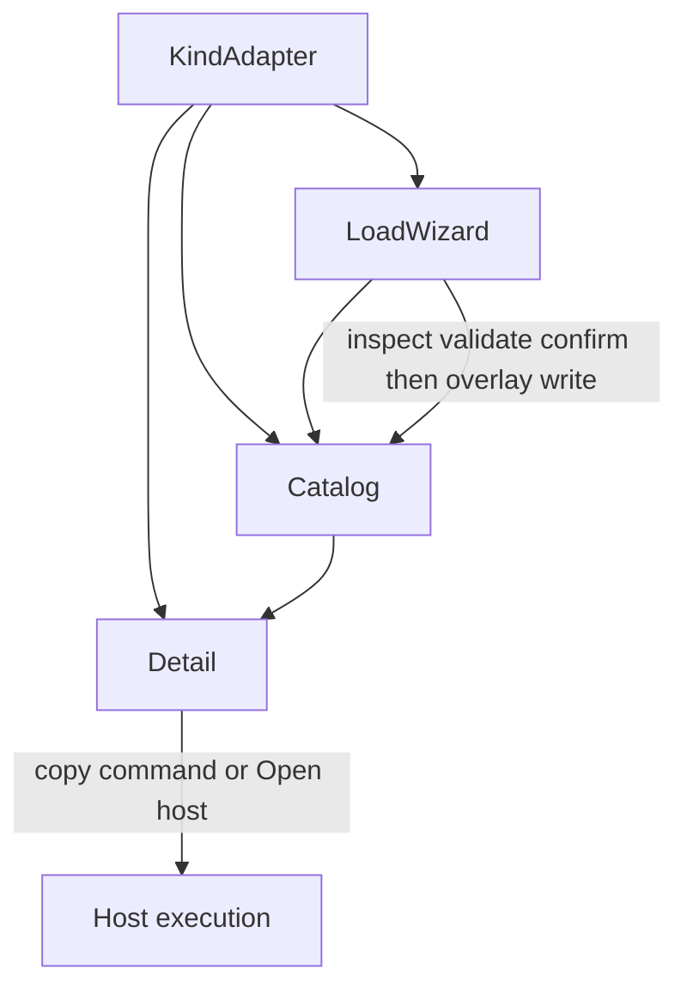

# Extension load units

**Status:** Normative composition contract for user-loadable pack content
**Classification:** feature population inside `CC-TUI` + `CC-PACK` + `CC-LIFE` (+ `CC-PROF` when the kind is a profile)
**SIB0:** not reopened. This is not a new capability class. It names the shared operator units already allowed by [`CODESLEUTH-PRODUCT-CONTRACT.md`](CODESLEUTH-PRODUCT-CONTRACT.md) §5–6.

Playbooks remains the **first complete user-facing instance**. The shared backend mechanics are now also implemented for Skills in [`pack/.opencode/bin/extension_catalog.py`](../pack/.opencode/bin/extension_catalog.py), but the Skill Catalog/Detail/Load-wizard TUI is not yet product-exposed. Profiles, tools/plugins, and host adapters must reuse the same units when their writable overlay contracts are proven instead of inventing a second wizard family.

Execution after load remains host-native. These units never become a CodeSleuth runner, scheduler, marketplace, or general-purpose tool router.

## Current implementation state

The implementation is deliberately split between a reusable backend and the operator UI so that documentation does not confuse a library primitive with a shipped control surface.

| Layer | Current state | Evidence |
| --- | --- | --- |
| shared local directory / ZIP source handling | **IMPLEMENTED** | `extension_catalog.py`, `tests/test_extension_catalog.py` |
| bounded ZIP extraction | **IMPLEMENTED** | entry-count, uncompressed-size, traversal and root-layout tests |
| overlay-over-pack resolution with truthful `origin` | **IMPLEMENTED** | generic extension tests plus existing Playbook catalog tests |
| inspect/validate before write | **IMPLEMENTED** | generic backend contract |
| explicit pack-shadow confirmation | **IMPLEMENTED** | Skill adapter tests |
| staged transactional replacement / rollback | **IMPLEMENTED** | generic backend replacement test |
| Playbook backend adapter | **IMPLEMENTED** | delegates parsing/validation to `playbook_catalog.py`; does not redefine Playbook semantics |
| Skill backend adapter | **IMPLEMENTED** | `SKILL.md` frontmatter, folder/name identity, `slash`, bounded Atomic Contract preview |
| Playbook Catalog/Detail/Load wizard TUI | **IMPLEMENTED** | existing first-instance TUI and viewport/control tests |
| Skill Catalog/Detail/Load wizard TUI | **PENDING** | backend exists; no product-facing shared TUI instance yet |
| Profile adapter / writable profile overlay | **UNRESOLVED** | builtin profile resolution exists, but current authority does not prove a writable profile overlay contract |
| Tool/plugin adapter | **PENDING** | do not implement until the shared product UI is extracted and the package/config ownership boundary is explicit |
| Host-adapter loader | **PENDING** | host-specific write boundary must remain bounded; host retains controller authority |

`IMPLEMENTED` in this table means implemented on the current development lineage with focused executable coverage. It does **not** mean integrated into `integration/rc7`, SIB-accepted, or released.

## Why this is one capability-shaped unit

Every user-loadable configuration has the same operator job:

```text
see what is loaded
  -> inspect one item's details
  -> load another item through a wizard that cannot silently write or execute
```

If each kind (Playbook, Skill, profile, tool) grows its own unrelated UI, operators cannot transfer skill and implementers will duplicate unsafe install paths. The kind-specific payload changes; the units do not.

## Shared units



### 1. Kind adapter

Kind-specific slot. Shared units call it; they do not embed Playbook JSON, Skill frontmatter, or profile schema.

A kind adapter MUST declare or provide the equivalent of:

| Field | Role |
| --- | --- |
| `kind_id` | stable id: `playbook`, `skill`, later `profile`, `tool`, `plugin`, `adapter` |
| `overlay_root` | target write/read path, e.g. `.opencode/playbooks/` |
| `pack_roots` | builtin/source catalogs that are not the overlay |
| `manifest_name` | file that identifies one item (`playbook.json`, `SKILL.md`, …) |
| `validate(package)` | kind invariants; errors block install, warnings do not |
| `detail_model` | what Detail renders (steps/skills/tools for Playbooks; metadata/Atomic Contract for Skills) |
| `host_command(item)` | copyable route into the host, or none |

`origin` is not adapter configuration. It is resolved per Catalog item after overlay/pack merge, together with the selected path and other provenance.

A new kind is a new adapter, not a new wizard architecture.

The reusable backend implementation is `extension_catalog.py`. Its Playbook adapter delegates to `playbook_catalog.py`, preserving the existing Playbook validator and parser as the semantic authority for that kind. The Skill adapter manages stored Skill bytes only. It never loads or invokes a Skill.

### 2. Catalog

The loaded list. Mandatory for every kind that has a load wizard.

The catalog MUST:

- list overlay items and pack items in one table;
- let **overlay win** whenever the same id exists in overlay and pack;
- report the resolved source truthfully: an item selected from the overlay is `origin=overlay` even if its manifest bytes happen to equal the pack manifest;
- show `id`, origin, and enough columns to choose a row (Playbooks: step count, `/playbook` or alias);
- treat each row as a control (not a log dump);
- open Detail on select;
- expose **Load** for that kind’s wizard.

The catalog MUST NOT execute the item.

First complete user-facing instance: Playbooks surface in [`pack/.opencode/bin/codesleuth_tui.py`](../pack/.opencode/bin/codesleuth_tui.py), Playbook-specific discovery in [`pack/.opencode/bin/playbook_catalog.py`](../pack/.opencode/bin/playbook_catalog.py). Generic backend discovery for Playbooks and Skills is in `extension_catalog.py`; that backend alone is not a claim that a Skill catalog screen exists.

### 3. Detail

The selected loaded item. Mandatory next to Catalog.

Detail MUST show:

- identity, origin, overlay/pack path;
- kind-specific body (Playbooks: step DAG, `skill:` / `tool:` chips from the manifest; Skills: declared metadata and bounded contract preview);
- provenance that chips inspect contracts and **do not** invoke Skills or Tools;
- optional copy of `host_command` and Open host.

Detail is for the operator and for the model’s declared surface. It is not Step or Skill execution.

At narrow viewports the catalog may hide so Detail fits; returning to Catalog must stay one control (surface button or Back). That is layout, not a different unit.

### 4. Load wizard

Shared phase machine. Kind adapters fill the slots; they do not skip phases.

```text
Source → Inspect → Validate → Confirm → Result
```

| Phase | Shared rule | Kind slot |
| --- | --- | --- |
| Source | local directory or zip in the first slice; remote URL is a later phase | expected layout / manifest name |
| Inspect | show id, origin path, counts, referenced objects **before any write** | parsed record |
| Validate | hard errors block Continue; warnings remain visible | `validate(package)` |
| Confirm | overlay destination, overwrite/collision, “this is a file write, not host execute” | overlay path; pack-id collision requires explicit confirm or reject |
| Result | item now in Catalog; next operator action is the host command if any | no auto-`/playbook`, no auto-Skill load |

Abort/Escape on Source–Confirm writes nothing.

Install copies into the overlay root. Replacement MUST be staged before the existing overlay is moved, and a failed stage/publish MUST preserve or restore the previous usable overlay. Pack builtins are not mutated. A user id absent from the pack manifest is not a managed overwrite on update.

The generic backend accepts a local directory or ZIP with exactly one top-level package directory. Root-level manifests are rejected rather than normalized implicitly. ZIP extraction is bounded by entry count and total uncompressed bytes and rejects absolute/traversal paths.

The existing Playbook TUI already exposes the five operator phases. The Skill backend implements the same source/inspect/validate/confirm/publish semantics programmatically, but a user-facing Skill wizard remains pending until the shared TUI phase machine is extracted rather than copied from `PlaybookLoadWizard`.

## Shared invariants

- Inspect before write.
- Overlay wins over pack on id whenever an overlay item exists.
- Resolved origin describes the selected source path, not manifest-byte equality.
- Silent shadowing of a pack id is forbidden; it requires explicit confirmation.
- Failed replacement does not destroy the previous usable overlay.
- Catalog/Detail/Wizard/backend install never execute the loaded object.
- Tool/Skill names are never invented from prose when the manifest omits them.
- Zip extract is bounded (entry count, uncompressed size, no `..` / absolute paths).
- Host remains execution authority.

## Kind instances

| Kind | Backend adapter | User-facing shared units | Overlay / write authority | Host route |
| --- | --- | --- | --- | --- |
| Playbook | **implemented** | **implemented first instance** | `.opencode/playbooks/<id>/` | `/playbook <id>` (overlay path first, then pack) |
| Skill | **implemented** | **pending** | `.opencode/skills/<id>/` | host loads/invokes the Skill on demand; backend never executes it |
| Profile | **UNRESOLVED** | pending | no writable overlay is claimed until current profile authority proves one | `/repo-profile` / settings |
| Tool / plugin | pending | pending | `.opencode/tools/` and plugin configuration require kind-specific ownership validation | host tool/plugin execution |
| Host adapter | pending | pending | adapter-specific bounded overlay only after its host contract is explicit | that host, never a CodeSleuth controller |

Do not start a Skill or profile wizard by forking or copying `PlaybookLoadWizard` into a parallel state machine. Extract one shared phase machine and supply a different kind adapter.

Do not treat the existence of `skill_adapter()` as proof that the Skill TUI exists. Backend capability and operator exposure are separate acceptance surfaces.

## What this must never become

- a second CodeSleuth controller or Playbook/Skill runtime;
- a marketplace or unsigned remote-exec channel in the first slice;
- a generic CRUD store for review/EHA ledgers;
- a reason to reopen SIB0 (adding a kind is pack/profile population, not a new class).

## Playbooks first instance

Historical design notes: [`PLAYBOOKS-CATALOG-TUI.md`](PLAYBOOKS-CATALOG-TUI.md).
Composition of Playbook/Step/Skill/Command/Tool: [`PLAYBOOK-SKILL-COMMAND-TOOL-CONTRACT.md`](PLAYBOOK-SKILL-COMMAND-TOOL-CONTRACT.md).

When a later kind becomes user-facing, update the kind table only after its Catalog + Detail + shared Load-wizard path has executable coverage. A backend adapter by itself does not satisfy that product-surface condition.
