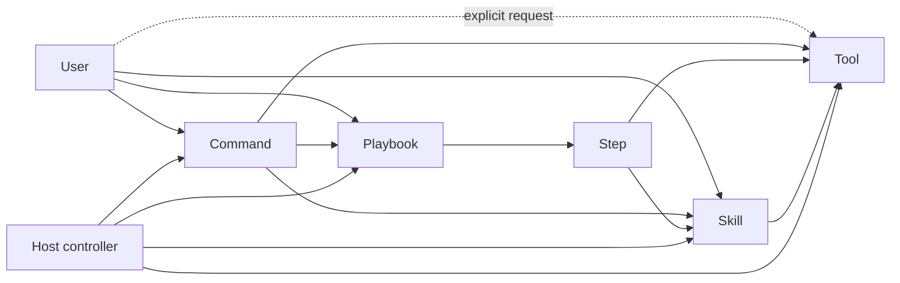

# Playbook, Step, Skill, Command, and Tool Contract

## Status

This document is the normative CodeSleuth contract for reusable agent instructions and multi-step workflows. It refines the product boundary in `CODESLEUTH-PRODUCT-CONTRACT.md`: the host coding agent remains execution authority; CodeSleuth supplies reusable instructions, workflow definitions, bounded tools, evidence/state helpers, and operator UX.

The goal is to make long prompts executable without making them permanently resident in model context.

## Core model



The canonical definitions are:

```text
Skill    = atomic reusable reasoning procedure loaded on demand
Step     = one independently executable Playbook unit
Playbook = ordered/DAG orchestration of Steps
Command  = user-facing prompt entry point
Tool     = bounded execution primitive
```

None of these entities is a second model runtime, supervisor, or general-purpose tool router. OpenCode or another active host owns sessions, model execution, subagents, permissions, and tool calling.

## Skill

A Skill is a reusable prompt/protocol for one atomic competence. In OpenCode it lives under `.opencode/skills/<id>/SKILL.md` and is discovered without loading the body into every prompt. The host loads the body when the Skill is invoked.

A Skill MUST have a completion boundary that can be judged without executing another Skill. Its contract must identify:

- input or preconditions;
- one objective;
- evidence/tools it may use;
- output;
- stop conditions;
- forbidden behavior.

A Skill MAY call bounded tools and read supporting files. It MUST NOT own a multi-stage campaign, silently sequence unrelated competencies, or become a substitute controller.

A useful test is:

> Can the agent decide whether this Skill completed successfully before starting any next workflow step?

If not, the instruction is probably a Playbook or several Skills.

Skills intended for direct operator use SHOULD be slash-exposed where the host supports it. Direct slash invocation does not change their atomicity.

## Step

A Step is one Playbook execution boundary. It is not automatically a Skill.

A Step contains only the information required for its own execution:

- objective;
- declared input from previous Steps or user arguments;
- referenced Skills;
- allowed/required tools when relevant;
- output contract;
- completion/stop conditions.

A Step can take either form:

1. **Skill Step**: the Step is exactly one existing Skill. The manifest references that Skill and does not duplicate its body.
2. **Composite Step**: the Step contains narrow task-specific instructions and may load one or more atomic Skills.

If a Step and a Skill have the same stable semantics, prefer the Skill and let the Step reference it. If the instructions are meaningful only inside one Playbook, keep them as a Step rather than creating a fake reusable Skill.

## Playbook

A Playbook is a stored multi-step operation. A 745-line task prompt with numbered execution points is a Playbook candidate, not a 745-line Skill.

CodeSleuth stores filesystem Playbooks under:

```text
pack/.opencode/playbooks/<playbook-id>/
    PLAYBOOK.md
    playbook.json
    steps/
        01-....md
        02-....md
```

`playbook.json` is the execution manifest. `PLAYBOOK.md` is a concise human description. Long step instructions live in separate files so the host never needs to materialize the complete workflow prompt at once.

The manifest records, for each Step:

```text
id
execution: skill | step
skill              # when execution=skill
prompt              # when execution=step
skills[]            # atomic competencies used by a composite Step
depends_on[]
output
isolation
```

Step identifiers are stable within a Playbook. Dependencies form an acyclic graph; a simple sequence is the common case.

## Step materialization and eviction

The parent controller SHOULD read only the Playbook manifest plus the current bounded workflow state. It MUST NOT preload all Step bodies.

For each runnable Step:

```text
manifest + dependency outputs
        ↓
materialize exactly one Step
        ↓
load only Skills required by that Step
        ↓
execute with host-native tools/subagent
        ↓
return bounded Step result
        ↓
retain result, not child prompt context
```

Where the host supports fresh child sessions, a Playbook Step SHOULD run in a fresh host-native subagent. OpenCode subagents have fresh context, so completion naturally leaves the parent with the bounded result rather than every Step prompt and Skill body.

The Step runner must not launch a CodeSleuth-owned supervisor. The normal parent remains OpenCode `build`; a host-native `general`/equivalent child is an execution isolation mechanism, not a second controller.

If the active host cannot provide fresh-step isolation, CodeSleuth may execute one Step in the current session, but it MUST NOT claim strict prompt eviction. Record `STEP_ISOLATION_UNPROVEN` when that distinction matters.

Compaction/pruning can reduce context pressure but is not proof of Step isolation.

## Workflow state

The Playbook definition is repository configuration. Runtime Step progress is not a new product source of truth.

Use host session state and existing CodeSleuth durable review/checkpoint facilities where appropriate. Do not add a Playbook database, scheduler, daemon, or execution runtime merely to remember which Step comes next.

A parent needs to retain only:

- exact target identity when relevant;
- completed Step ids;
- bounded outputs required by later Steps;
- unresolved stop conditions;
- next runnable Step.

## Command

A Command is a user-facing prompt entry point, normally slash-invoked. It may:

- start a Playbook;
- invoke one Skill;
- request one or more Tools;
- provide arguments/defaults/presentation.

A Command MUST NOT be the only place where important semantic rules live. Reusable reasoning belongs in Skills; multi-step order belongs in Playbooks; deterministic behavior belongs in Tools; normative contracts belong in docs/tests.

Commands may be convenient aliases over the same underlying Skill or Playbook.

## Tool

A Tool is a bounded execution primitive. It should be as deterministic as the underlying operation allows and should return data rather than hidden policy.

Tools are usually model-called. A Tool may also be exposed to the user through a Command or host UI when direct invocation is useful. A user can explicitly ask the agent to call a Tool and return its result, for example a web-search/web-fetch/GitHub-search evidence cycle.

Tool invocation does not make the Tool a Skill. The reasoning protocol that decides what to search, how to verify it, and when to stop belongs in a Skill or Step.

## Retrieval example

A request such as “webfetch this problem” can legitimately mean a small evidence workflow:

```text
web search
  -> fetch primary/current sources
  -> GitHub/code search when implementation evidence matters
  -> reopen exact source
  -> return verified result
```

`websearch`, `webfetch`, and GitHub search/fetch are Tools. The evidence-selection discipline is a Skill. A larger investigation that repeats the cycle across several questions is a Playbook.

## Direct invocation

The intended operator surface is:

```text
/<skill-id> ...      # atomic competence, where host slash exposure supports Skills
/playbook <id> ...   # multi-step workflow
/<command> ...       # product-specific entry point
```

A Tool can be invoked indirectly through a Command or explicitly requested in natural language. Host-native direct Tool UI remains host-owned.

## Atomic Skill standard

Every maintained CodeSleuth Skill SHOULD be short enough to load cheaply, but line count is not the definition of atomicity. Each Skill must contain an `Atomic contract` section with:

```text
Input
Objective
Output
Stop
Must not
```

It should name tools only when their use is part of the competence. It should link to normative docs rather than reproducing them.

A Skill fails the standard when it:

- contains a full campaign lifecycle;
- has several independently useful outputs separated by phases;
- tells the agent to load another broad Skill and continue indefinitely;
- embeds release/SIB orchestration that belongs in a Playbook;
- duplicates Tool implementation semantics;
- requires later steps before its own success can be judged.

## Playbook execution algorithm

The host controller executes a Playbook as follows:

1. Resolve exact Playbook id and read `playbook.json` only.
2. Validate the manifest and requested target/arguments.
3. Determine runnable Step(s) from `depends_on` and retained outputs.
4. Materialize exactly one Step.
5. For a Skill Step, load only the named Skill.
6. For a composite Step, read only its prompt file and load only its declared Skills.
7. Prefer a fresh host-native child session for Step isolation.
8. Execute tools under normal host permissions.
9. Require the Step output contract or stop classification.
10. Retain the bounded result/checkpoint and release the child context.
11. Continue with the next runnable Step.
12. Stop the Playbook on a declared blocker; do not improvise around acceptance/authority failures.

Parallel Steps are allowed only when dependencies and write targets are independent. Parallelism is host orchestration, not a new CodeSleuth scheduler.

## Relationship to SIB/EHA

Playbook completion is not acceptance by itself. A SIB/EHA/RC/release Playbook must still bind evidence to the exact candidate SHA and required acceptance profile.

A long SIB establishment prompt should therefore become a Playbook whose Steps use atomic identity, inventory, contract, forbidden-regression, acceptance, and reporting Skills. When a final candidate SHA is frozen, the EHA Step must test that SHA without mutating it. Repair creates a new candidate and a new acceptance campaign.

## Current migration rule

Legacy CodeSleuth Skills that contain whole workflows must be decomposed:

- `repository-deep-review` becomes an atomic bounded-slice review competence plus a `repository-deep-review` Playbook;
- `feature-porting-discipline` becomes an atomic portable-contract extraction competence plus a `feature-port` Playbook;
- `protected-capability-registry` becomes an atomic registry query competence, with triangulation, forbidden-regression, and dependency-impact Skills composed by a `protected-capability-assessment` Playbook;
- `codesleuth-reports` remains an atomic persistence Skill.

No compatibility shim may silently reload the former giant prompt. If a legacy Skill id is retained, its new body must itself satisfy the atomic contract.

## References

- OpenCode Skills: <https://opencode.ai/v2/docs/skills>
- OpenCode Commands: <https://opencode.ai/v2/docs/commands>
- OpenCode Agents/subagents: <https://opencode.ai/v2/docs/agents>
