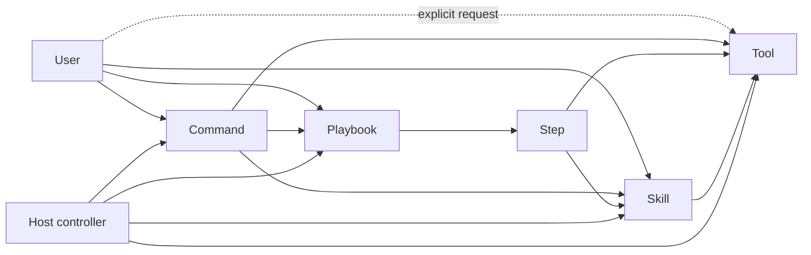

# Playbook, Step, Skill, Command, and Tool Contract

## Status

**Normative composition contract for feature population inside `CC-PACK`.**

This document defines how CodeSleuth packages reusable agent instructions and multi-step workflows without creating a second execution runtime. It refines the ownership boundary in [`CODESLEUTH-PRODUCT-CONTRACT.md`](CODESLEUTH-PRODUCT-CONTRACT.md) and the frozen SIB0 inventory in [`SIB0-CAPABILITY-INVENTORY.md`](SIB0-CAPABILITY-INVENTORY.md).

This docs-only contract does **not** claim that a Playbook runner, decomposed atomic Skill set, or any particular filesystem Playbook catalog is implemented on the commit that first carries the document. Implementation and promotion remain separate SIB1/SIB2/EHA work.

The architectural placement is already frozen by SIB0: concrete Skills, Playbooks, commands, agents, plugins, themes, and workflows are feature population inside `CC-PACK` unless they introduce a new authority, runtime, persistence plane, or ownership boundary.

## Core model



Canonical definitions:

```text
Skill    = atomic reusable reasoning procedure loaded on demand
Step     = one independently executable Playbook unit
Playbook = ordered/DAG orchestration of Steps
Command  = user-facing prompt entry point
Tool     = bounded execution primitive
```

None of these entities is a second model runtime, supervisor, scheduler, or general-purpose tool router. The active host owns sessions, model execution, subagents, permissions, and tool calling.

## Skill

A Skill is a reusable prompt/protocol for one atomic competence. Where the host supports native Skills, the Skill body is loaded on demand rather than permanently resident in every model prompt.

A Skill MUST have a completion boundary that can be judged without executing another Skill. Its contract identifies:

- input or preconditions;
- one objective;
- evidence/tools it may use;
- output;
- stop conditions;
- forbidden behavior.

A Skill MAY call bounded tools and read supporting files. It MUST NOT own a multi-stage campaign, silently sequence unrelated competencies, or become a substitute controller.

A useful test is:

> Can the agent decide whether this Skill completed successfully before starting any next workflow step?

If not, the instruction is probably a Playbook, a Step, or several Skills.

Skills intended for direct operator use SHOULD be slash-exposed where the host supports it. Direct invocation does not change their atomicity.

## Step

A Step is one Playbook execution boundary. It is not automatically a Skill.

A Step contains only the information required for its own execution:

- objective;
- declared input from previous Steps or user arguments;
- referenced Skills;
- allowed/required tools when relevant;
- output contract;
- completion/stop conditions.

A Step can take either form:

1. **Skill Step**: the Step is exactly one existing Skill. The Playbook references that Skill and does not duplicate its body.
2. **Composite Step**: the Step contains narrow task-specific instructions and may load one or more atomic Skills.

If a Step and a Skill have the same stable semantics, prefer the Skill and let the Step reference it. If the instructions are meaningful only inside one Playbook, keep them as a Step rather than manufacturing a fake reusable Skill.

## Playbook

A Playbook is a stored multi-step operation. A long numbered task prompt is a Playbook candidate, not a giant Skill.

A Playbook definition MUST keep workflow ordering separate from reusable competences. Its representation contains, directly or through an equivalent host-native form:

```text
playbook identity
steps[]
step dependencies
step execution kind
referenced skills
step output contracts
step isolation requirements
stop conditions
```

Step identifiers are stable within a Playbook. Dependencies form an acyclic graph; a simple sequence is the common case.

When a filesystem catalog is implemented for the OpenCode pack, the preferred shape is:

```text
pack/.opencode/playbooks/<playbook-id>/
    PLAYBOOK.md
    playbook.json
    steps/
        01-....md
        02-....md
```

This path is a target convention, not evidence that the catalog exists on every commit carrying this document.

## Step materialization and context release

The parent controller SHOULD read only the Playbook manifest plus the current bounded workflow state. It MUST NOT preload every Step body.

For each runnable Step:

```text
manifest + dependency outputs
        ↓
materialize exactly one Step
        ↓
load only Skills required by that Step
        ↓
execute with host-native tools/subagent
        ↓
return bounded Step result
        ↓
retain result, not child prompt context
```

Where the active host supports fresh child sessions, a Step SHOULD run in a fresh host-native subagent so the parent retains the bounded Step result rather than every Step prompt and Skill body.

The Step runner MUST NOT launch a CodeSleuth-owned supervisor. Host-native subagents are an execution/isolation mechanism owned by the host, not a new CodeSleuth controller.

If the host cannot provide fresh-Step isolation, CodeSleuth may execute one Step in the current session, but it MUST NOT claim strict prompt eviction. Record `STEP_ISOLATION_UNPROVEN` when that distinction matters.

Compaction/pruning can reduce context pressure but is not proof of Step isolation.

## Workflow state

The Playbook definition is repository configuration. Runtime Step progress is not a new product source of truth.

Use host session state and existing CodeSleuth durable review/checkpoint facilities where appropriate. Do not add a Playbook database, daemon, scheduler, or execution runtime merely to remember which Step comes next.

A parent normally needs to retain only:

- exact target identity when relevant;
- completed Step ids;
- bounded outputs required by later Steps;
- unresolved stop conditions;
- next runnable Step.

## Command

A Command is a user-facing prompt entry point, normally slash-invoked. It may:

- start a Playbook;
- invoke one Skill;
- request one or more Tools;
- provide arguments, defaults, or presentation.

A Command MUST NOT be the only place where important semantic rules live. Reusable reasoning belongs in Skills; multi-step order belongs in Playbooks; deterministic behavior belongs in Tools; normative contracts belong in docs/tests.

Commands may be convenient aliases over the same underlying Skill or Playbook.

## Tool

A Tool is a bounded execution primitive. It should be as deterministic as the underlying operation allows and should return data rather than hidden policy.

Tools are usually model-called. A Tool may also be exposed through a Command or host UI when direct invocation is useful. A user can explicitly ask an agent to call a Tool and return its result.

Tool invocation does not make the Tool a Skill. The reasoning protocol that decides what to call, how to verify the result, and when to stop belongs in a Skill or Step.

## Retrieval example

A request such as “webfetch this problem” can reasonably denote a small evidence workflow:

```text
web search
  -> fetch primary/current sources
  -> GitHub/code search when implementation evidence matters
  -> reopen exact source
  -> return verified result
```

`websearch`, `webfetch`, and GitHub search/fetch are Tools. Evidence-selection discipline is a Skill. A larger investigation that repeats the cycle across several questions is a Playbook.

## Atomic Skill standard

Every maintained CodeSleuth Skill SHOULD be short enough to load cheaply, but line count is not the definition of atomicity. Each atomic Skill should expose an explicit contract equivalent to:

```text
Input
Objective
Output
Stop
Must not
```

A Skill fails the standard when it:

- contains a full campaign lifecycle;
- has several independently useful outputs separated by phases;
- tells the agent to load another broad Skill and continue indefinitely;
- embeds release/SIB orchestration that belongs in a Playbook;
- duplicates Tool implementation semantics;
- requires later workflow Steps before its own success can be judged.

## Playbook execution contract

A host executing a CodeSleuth Playbook should:

1. resolve the exact Playbook identity and read only its manifest/summary initially;
2. validate the requested target and arguments;
3. determine runnable Step(s) from dependencies and retained outputs;
4. materialize exactly one Step per execution boundary;
5. load only the atomic Skills declared for that Step;
6. prefer a fresh host-native child session where supported;
7. execute tools under normal host permissions;
8. require the Step output contract or stop classification;
9. retain the bounded result/checkpoint and release child context when isolation exists;
10. continue with the next runnable Step;
11. stop on a declared blocker instead of improvising around authority or acceptance failures.

Parallel Steps are allowed only when dependencies and write targets are independent. Parallelism remains host orchestration; CodeSleuth does not gain a scheduler.

## Relationship to SIB/EHA

Playbook completion is not acceptance by itself. A SIB/EHA/RC/release Playbook must still bind evidence to the exact candidate SHA and required acceptance profile.

A long SIB-establishment prompt should become a Playbook whose Steps use atomic identity, inventory, contract, forbidden-regression, acceptance, and reporting competences. When a final candidate SHA is frozen, an EHA Step tests that SHA without mutating it. Repair creates a new candidate and a new acceptance campaign.

This composition model does not reopen the current SIB0 inventory because it remains inside `CC-PACK` and preserves the host-execution boundary. A future implementation that adds a CodeSleuth-owned scheduler, session runtime, general-purpose router, or independent workflow database would violate that premise and require architectural re-evaluation.

## Migration rule

Legacy CodeSleuth Skills that contain whole workflows should be decomposed when the implementation layer is refit:

- broad review workflow -> bounded review Skills + a review Playbook;
- feature-porting workflow -> portable-contract/ownership/acceptance Skills + a port Playbook;
- protected-capability workflow -> registry query, triangulation, forbidden-regression, and dependency-impact Skills composed by an assessment Playbook;
- report persistence remains an atomic reporting Skill where its completion boundary is already independent.

No compatibility shim should silently reload a former giant prompt under an apparently atomic Skill id.

## Evidence status at docs-only adoption

At the commit that first adopts only this document:

- SIB0 placement is supported by `CC-PACK` in [`SIB0-CAPABILITY-INVENTORY.md`](SIB0-CAPABILITY-INVENTORY.md);
- no Playbook runtime or new authority is introduced;
- no existing Skill is claimed to have been decomposed merely because this contract exists;
- implementation status remains whatever exact code/config/tests on that candidate prove;
- future implementation requires its own SIB1/SIB2/EHA evidence on the exact resulting SHA.

## External host references

The current OpenCode V2 documentation describes Skills as on-demand reusable instructions, exposes Skills through its interactive command catalog unless disabled, defines Commands as reusable prompt templates, and runs subagents in child sessions with fresh context. These host behaviors are supporting implementation facts, not CodeSleuth product authority.

- OpenCode V2 Skills: <https://opencode.ai/v2/docs/skills>
- OpenCode V2 Config / Commands: <https://opencode.ai/v2/docs/config>
- OpenCode V2 Agents: <https://opencode.ai/v2/docs/agents>
