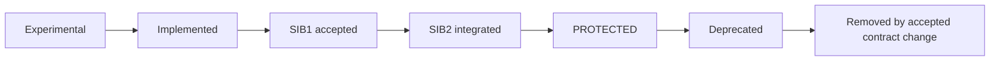
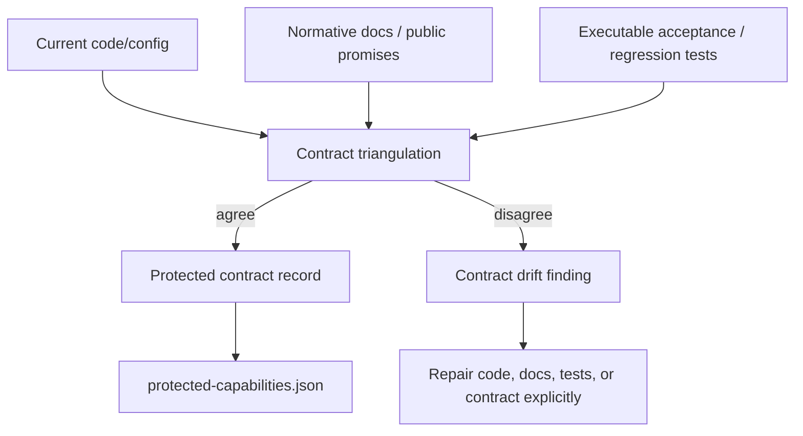
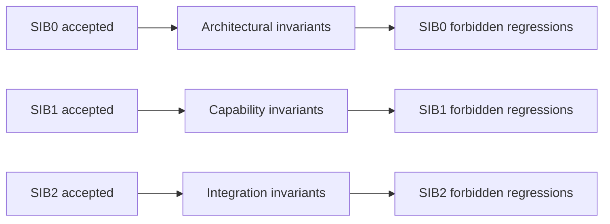
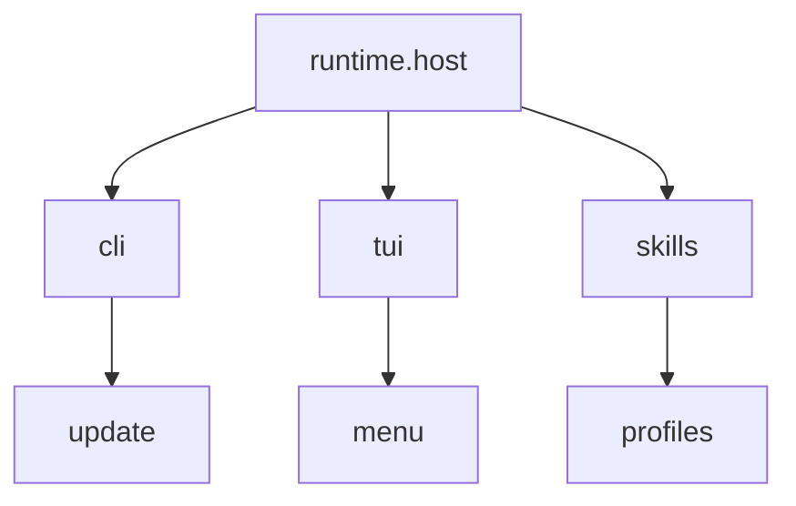
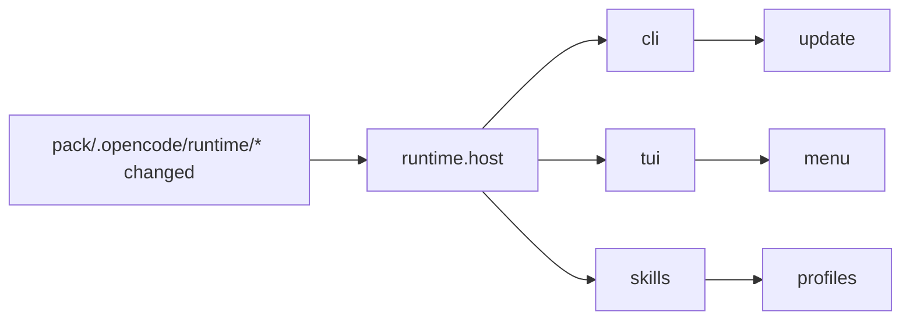
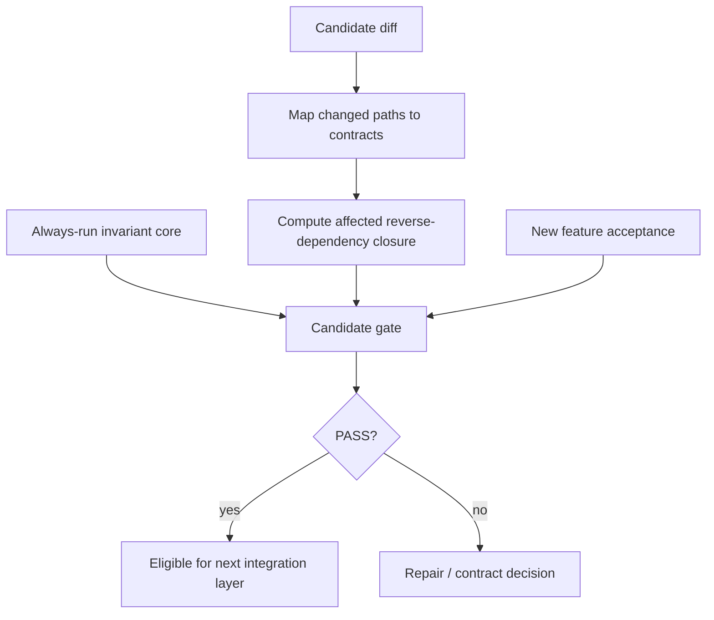
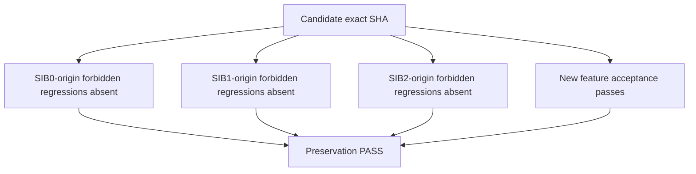

# Protected capability contracts and forbidden regressions

## Status

This document is a **normative extension** of the CodeSleuth SIB0/SIB1/SIB2 and Exact-Head Acceptance model defined by [`STABLE-INTEGRATION-BASELINE.md`](STABLE-INTEGRATION-BASELINE.md) and [`EXACT-HEAD-ACCEPTANCE.md`](EXACT-HEAD-ACCEPTANCE.md).

It defines how capabilities that survived SIB1 implementation acceptance and SIB2 integration acceptance remain protected while later release features are added.

The governing rule is:

> **A capability accepted through SIB2 becomes a protected contract. Every protected contract carries its own registry of forbidden regressions, and later candidates must prove that the relevant forbidden states did not return.**

This does not claim that regressions can be made impossible. Software remains software. The enforceable claim is narrower and useful: once the project has identified an unacceptable state and attached it to an accepted contract, later work is not allowed to reintroduce that state silently.

## Protected capability lifecycle



`PROTECTED` means:

1. the accepted public or architectural contract cannot change silently;
2. acceptance evidence for the contract is retained as a permanent regression obligation;
3. a behavior change requires an explicit contract change;
4. removal requires an explicit deprecation/removal decision;
5. every later feature must preserve the protected contract unless that contract is deliberately superseded;
6. the contract owns a non-empty `forbidden_regressions` registry describing known states that must not reappear.

The distinction is:

```text
test coverage             = tests that happen to exercise implementation today
accepted behavior coverage = durable proof obligations attached to accepted contracts
```

Implementation tests may be rewritten with the implementation. Accepted behavior coverage must survive the implementation unless the corresponding contract is explicitly changed.

## Contract record

The canonical machine-readable registry is [`protected-capabilities.json`](protected-capabilities.json).

A protected contract record contains at least:

```text
id
capability_class
status
introduced
protected_at
public_contract
code_evidence[]
doc_evidence[]
test_evidence[]
affected_paths[]
depends_on[]
forbidden_regressions[]
```

A `protected_at` entry identifies the historical exact SHA / SIB evidence that promoted the contract to protected status. It does **not** imply that an arbitrary descendant SHA has fresh acceptance evidence. Exact-head acceptance still applies to every candidate claim.

The registry is a compact contract index, not a replacement for source, documentation, or tests. Its statements must be traceable back to all three.

## Three-source contract extraction

CodeSleuth derives and maintains protected contracts from three evidence families:



No single source is sufficient by itself:

- code without docs/tests may be an implementation accident;
- docs without code/tests may be an unimplemented promise;
- tests without code/docs may encode obsolete or accidental behavior.

When the three sources disagree, the agent must not average them into a synthetic contract. Classify the drift and surface it for a decision. Useful classes are:

- `CODE_AHEAD` — implementation changed but promises/tests did not;
- `DOC_AHEAD` — documentation promises behavior not implemented/proven;
- `TEST_AHEAD` — tests require behavior not represented by the accepted contract;
- `CONTRADICTED` — sources make incompatible claims;
- `UNPROVEN` — a plausible contract lacks sufficient executable evidence.

Only an explicitly accepted resolution may update a protected contract's meaning.

## Every contract owns forbidden regressions

There is no single undifferentiated global list that substitutes for contract ownership.

**Every protected contract record MUST contain its own `forbidden_regressions` array.** Each forbidden regression has a stable id and explains which previously excluded state must not return.

Example:

```json
{
  "id": "codesleuth.update-restart",
  "status": "protected",
  "public_contract": [
    "a successful update can be applied and the running CodeSleuth instance can be restarted/reloaded into the updated source"
  ],
  "forbidden_regressions": [
    {
      "id": "FR-UPDATE-001",
      "sib_origin": "SIB2",
      "must_not": "report update success while restart/reload still executes the previous source",
      "proof": ["tests/test_update_restart.py"]
    }
  ]
}
```

A forbidden regression is not merely a bug description. It is a **negative acceptance obligation** attached to a contract.

Removing a forbidden-regression entry is itself a contract change. It requires an explicit reason, and where behavior is intentionally removed or superseded, the deprecation/removal lineage must be recorded rather than silently deleting the historical guard.

## SIB-X defines the forbidden-regression taxonomy

SIB-X gives the project the class of regression that must no longer be allowed to recur after that maturity claim has been accepted.



### SIB0-origin forbidden regressions

These describe architectural states that must not silently return after the architecture was frozen, for example:

- duplicate ownership of a fundamental responsibility;
- a second controller/runtime/orchestration authority appearing without reopening architecture;
- undeclared persistence authority or a second source of truth;
- a capability class being added, removed, or fundamentally redefined without a new SIB0 lineage;
- dependency direction or ownership boundaries reverting to a state already rejected by SIB0.

### SIB1-origin forbidden regressions

These describe capability-level states that must not return after the capability was proven real, for example:

- a protected basic path becoming a stub, placeholder, unreachable action, or no-op;
- a public command/config/schema disappearing without contract change;
- a capability continuing to exist nominally while no longer performing its minimum function;
- a repaired capability defect recurring after its regression test became part of accepted behavior coverage.

### SIB2-origin forbidden regressions

These describe integration/composition states that must not return after end-to-end acceptance, for example:

- two individually working capabilities no longer composing correctly;
- lifecycle state and runtime state diverging;
- update succeeds but restart/reload does not use the updated source;
- TUI dispatch succeeds internally while user-visible result/feedback is lost;
- an accepted supported-environment path silently stops working;
- a persistence/controller/tool boundary breaks despite each component passing focused tests.

The SIB level supplies the **origin and severity class**. The concrete forbidden regression still belongs to the individual contract that it protects.

## Capability dependency graph

Protected contracts declare `depends_on` relationships and `affected_paths` hints. This permits a bounded affected-closure gate during ordinary feature development.

Conceptually:



A change to the runtime can affect the reverse dependency closure:



The graph is a gate-selection aid. It is not permission to ignore direct evidence. If a diff touches a contract surface that the graph failed to model, the graph is wrong and must be corrected.

## Gate selection

Running the full historical suite after every keystroke eventually turns CI into a small public utility company. Ordinary feature development may therefore use dependency-aware selection while retaining a small always-run invariant core.



Canonical shorthand:

```text
Gate(candidate) = invariant-core + affected-capability-closure + new-feature-tests
```

The always-run invariant core should remain intentionally small and high value. For CodeSleuth it includes at least the current canonical checks protecting installation/startup viability, basic CLI/TUI reachability where applicable, state integrity, version/identity contracts, and manifest integrity.

Dependency-aware selection is an optimization for ordinary PR/candidate development. It does **not** weaken an acceptance profile whose claim already requires the full suite.

For any exact head being promoted as SIB2, an accepted full integration state, an RC, or a release, run the complete profile required by that claim:

```text
Gate(SIB2/RC/release) = FULL canonical protected-capability suite + release-specific gates
```

Exact-head semantics remain unchanged: the tested SHA and promoted SHA must be identical.

## Candidate preservation proof

A post-SIB2 feature candidate must answer two independent questions:

```text
1. Does the new feature work?
2. Which protected contracts can this diff affect, and are their forbidden regressions still absent?
```

The second question is not optional merely because the contributor believes the change is local.

The preservation model is:



For a dependency-aware development gate, `S0/S1/S2` means the invariant core plus the affected protected closure. For full SIB2/RC/release acceptance it means the entire required protected set.

## Contract fingerprints

Some protected properties are easier to compare structurally than to exercise exhaustively in runtime tests, including:

- schemas;
- CLI options;
- persisted state formats;
- environment variables;
- plugin/adapter interfaces;
- public paths;
- configuration keys.

The manifest may therefore record compact public-contract values and evidence paths as a **contract fingerprint**. A candidate that changes such a fingerprint must either preserve compatibility or carry an explicit accepted contract-change declaration.

A fingerprint is not a hash-only semantic oracle. Hashes may identify evidence blobs, but contract meaning is represented by the manifest statement plus code/docs/test provenance. Semantic decisions must never be made from opaque ids alone.

## Querying a large registry

The registry is designed to remain usable without a dedicated database.

For a small or medium manifest, use normal repository search:

```text
grep / ripgrep -> exact matching entries -> paged read of the manifest and evidence
```

If the registry becomes large and the host already provides local retrieval components, agents may use:

```text
BM25 candidate retrieval -> optional embedding retrieval -> optional reranker -> exact manifest re-read
```

These retrieval layers are navigation aids only. They may answer questions such as:

> Which protected contracts concern persisted state, restart semantics, or host execution ownership?

But the final answer must be grounded in the exact manifest records and their cited code/docs/tests. Retrieval scores never create, remove, or reinterpret a contract.

CodeSleuth must not introduce an independent heavyweight search service merely to query this file. Use host-native/local capabilities when present; otherwise use grep plus bounded reads.

## Contract maintenance workflow

When a feature is introduced or changed:

1. pin the exact candidate SHA;
2. identify affected paths and candidate protected contracts;
3. read the exact registry entries;
4. inspect current code, normative/public docs, and executable tests;
5. classify any disagreement rather than silently resolving it;
6. add/update the candidate contract record and its own forbidden regressions when the behavior is deliberately changing;
7. add acceptance/regression proof for new forbidden states discovered during repair;
8. run the dependency-aware development gate;
9. run the full profile when the resulting head is being promoted to a maturity/release state requiring it;
10. record fresh exact-head acceptance evidence.

A newly added feature does not become `PROTECTED` merely because its implementation merged. Protection follows the accepted lifecycle:

```text
implemented -> SIB1 accepted -> SIB2 integrated -> PROTECTED
```

## EHA repair consequence

The EHA repair loop already requires a reproducible defect to leave behind a regression test. Once the repaired capability is accepted, the corresponding forbidden state should also be recorded under that contract's `forbidden_regressions` registry.

Thus a repaired defect leaves two durable traces:

```text
positive proof: this accepted behavior works
negative proof: this previously observed unacceptable state must not return
```

This converts repair history into future acceptance obligations instead of leaving it as archaeology in an old PR.

## Canonical statements

> **Protected capability:** an SIB2-integrated accepted capability whose contract and accepted behavior coverage become preservation obligations for later development.

> **Forbidden regression:** a stable, contract-owned negative acceptance obligation describing a previously excluded state that must not silently reappear.

> **Protected Capability Registry:** the machine-readable index of protected contracts, their code/docs/test provenance, dependency/impact metadata, and contract-owned forbidden regressions.

> **SIB-X regression taxonomy:** SIB0 contributes architectural invariants, SIB1 contributes capability invariants, and SIB2 contributes integration invariants; concrete forbidden regressions are stored under the contracts they protect.

> **Dependency-aware gate:** invariant core plus affected protected-capability closure plus new-feature acceptance, used to keep ordinary development bounded without weakening full SIB2/RC/release acceptance.

The practical rule is:

> **After a SIB-X EHA has excluded a class of failure for an accepted contract, write down what must not happen again, attach executable proof where possible, and make every relevant descendant earn the right not to be called a regression.**
