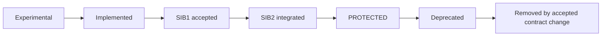
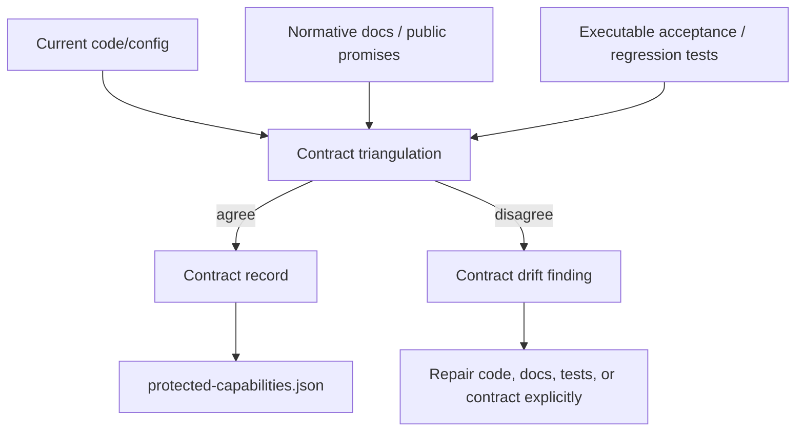
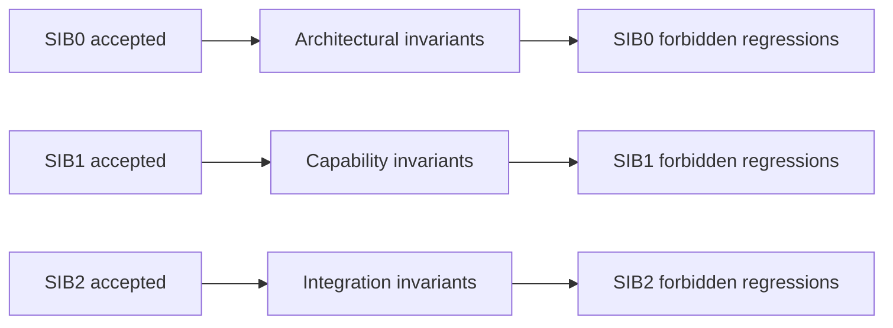
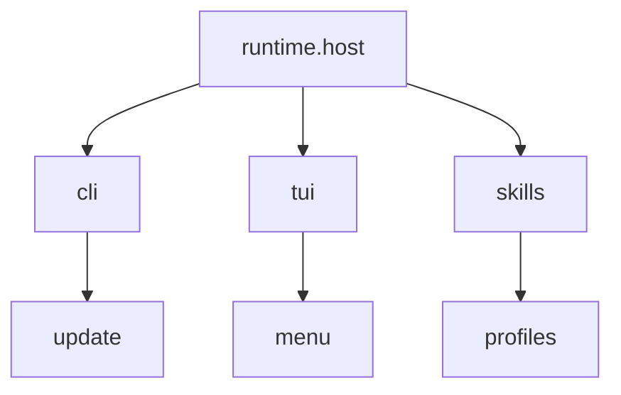
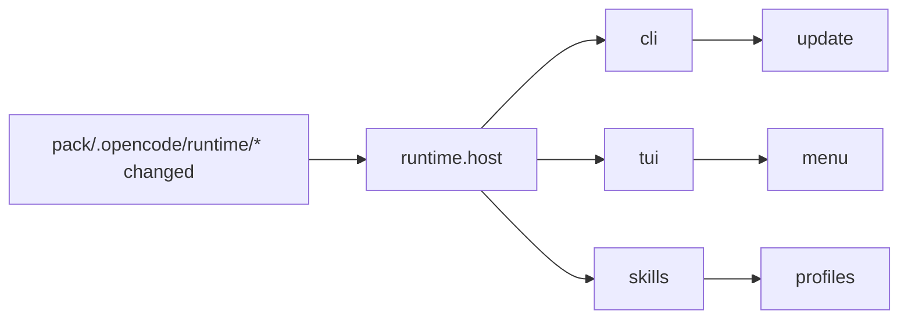
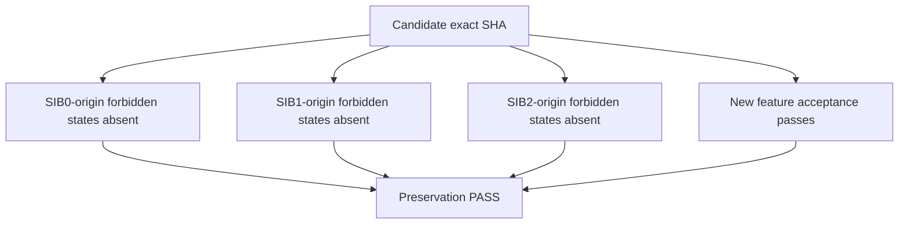

# Protected capability contracts and forbidden regressions

## Status

This document is a **normative extension** of [`STABLE-INTEGRATION-BASELINE.md`](STABLE-INTEGRATION-BASELINE.md), [`EXACT-HEAD-ACCEPTANCE.md`](EXACT-HEAD-ACCEPTANCE.md), and the repair discipline in [`EHA-REPAIR-LOOP.md`](EHA-REPAIR-LOOP.md).

It defines how CodeSleuth preserves capabilities while new release features are added after SIB2.

The governing rule is:

> **Every contract record owns its own registry of forbidden regressions. Once that contract is accepted through the relevant SIB/EHA path, those negative obligations become part of the behavior that later candidates must preserve.**

This does not claim that regressions can be made impossible. It makes a narrower, enforceable claim: once an unacceptable state is known and attached to a contract, later work may not reintroduce it silently.

## Protected capability lifecycle



A contract record exists before protection and already carries its `forbidden_regressions` ledger. Before protection, those entries are candidate/observed negative obligations associated with the contract. As the capability passes SIB1/SIB2 acceptance, the applicable entries become accepted preservation obligations. At `PROTECTED`, the accepted contract and its ledger are part of the normal regression boundary for later release work.

`PROTECTED` means:

1. the accepted public or architectural contract cannot change silently;
2. acceptance evidence becomes durable regression obligation;
3. a behavior change requires an explicit contract change;
4. removal requires an explicit deprecation/removal decision;
5. later features must preserve the contract unless it is deliberately superseded;
6. the contract-owned forbidden-regression ledger cannot be silently weakened or deleted.

The distinction is:

```text
test coverage              = tests that happen to exercise implementation today
accepted behavior coverage = durable proof obligations attached to accepted contracts
```

Implementation tests may be rewritten with implementation. Accepted behavior coverage survives implementation unless the corresponding contract changes explicitly.

## Machine-readable registry

The canonical registry is [`protected-capabilities.json`](protected-capabilities.json).

Every contract record contains at least:

```text
id
capability_class
status
introduced
protected_at
public_contract
code_evidence[]
doc_evidence[]
test_evidence[]
affected_paths[]
depends_on[]
forbidden_regressions[]
```

`forbidden_regressions[]` is mandatory for **every** recorded contract, not only contracts already in `PROTECTED` state.

A `protected_at` entry identifies historical exact-SHA/SIB evidence that promoted the contract. It does not transfer exact-head acceptance to descendants. Exact-head acceptance still applies to every candidate claim.

The registry is an index, not a replacement for source, docs, or tests.

## Three-source contract extraction

Contracts are derived from three evidence families:



No single source is sufficient:

- code without docs/tests may be an implementation accident;
- docs without code/tests may be an unimplemented promise;
- tests without code/docs may encode obsolete or accidental behavior.

When sources disagree, do not average them into a synthetic contract. Classify drift:

- `CODE_AHEAD` — implementation changed but promises/tests did not;
- `DOC_AHEAD` — documentation promises behavior not implemented/proven;
- `TEST_AHEAD` — tests require behavior not represented by the accepted contract;
- `CONTRADICTED` — sources make incompatible claims;
- `UNPROVEN` — a plausible contract lacks sufficient executable evidence.

Only an explicit accepted resolution may change protected meaning.

## Contract-owned forbidden regressions

Each `forbidden_regressions` entry has a stable id, `sib_origin`, a concrete `must_not` statement, and proof/evidence where available.

Example:

```json
{
  "id": "codesleuth.update-restart",
  "status": "implemented",
  "forbidden_regressions": [
    {
      "id": "FR-UPDATE-001",
      "sib_origin": "SIB2",
      "must_not": "report update success while restart/reload still executes the previous source",
      "proof": ["tests/test_update_restart.py"]
    }
  ]
}
```

At `implemented`, this records the negative state the contract intends to exclude and the proof expected to support it. Once the capability receives the relevant acceptance and becomes protected, the same entry becomes an accepted regression obligation rather than a design intention.

A forbidden regression is therefore not merely a bug description. It is a contract-owned **negative acceptance obligation**, with normative strength determined by the contract's accepted lifecycle state.

Removing or weakening an accepted `FR-*` entry is a contract change. Record deprecation/removal/supersession instead of deleting history because a new implementation is inconvenient.

## SIB-X supplies the regression taxonomy



### SIB0-origin forbidden regressions

States that must not silently return after architecture was frozen, including:

- duplicate ownership of a fundamental responsibility;
- a second controller/runtime/orchestration authority without reopening architecture;
- undeclared persistence authority or a second source of truth;
- adding/removing/redefining a capability class without a new SIB0 lineage;
- rejected dependency direction or ownership boundaries returning.

### SIB1-origin forbidden regressions

States that must not return after a capability was proven real, including:

- an accepted basic path becoming a stub, placeholder, unreachable action, or no-op;
- a public command/config/schema disappearing without contract change;
- nominal capability presence while its minimum function no longer works;
- a repaired capability defect recurring after accepted regression coverage was added.

### SIB2-origin forbidden regressions

States that must not return after composition was accepted, including:

- individually working capabilities no longer composing correctly;
- lifecycle state and runtime state diverging;
- update succeeds but restart/reload does not use updated source;
- TUI dispatch succeeds internally while user-visible feedback is lost;
- an accepted environment path silently stops working;
- persistence/controller/tool boundaries fail despite focused component tests passing.

SIB supplies the **class and origin**. The concrete forbidden regression remains stored under the individual contract it protects.

## Dependency graph and affected closure

Contracts declare `depends_on` and `affected_paths` so ordinary development can select a bounded regression set.



When a dependency changes, compute the reverse dependency closure:



The graph selects gates; it never overrides exact source evidence. If source reading reveals an affected consumer missing from the graph, the registry is incomplete and must be corrected.

## Gate selection

Ordinary feature development may use dependency-aware selection plus a small always-run invariant core:

```mermaid
flowchart TD
    DIFF[Candidate diff] --> PATHS[Map changed paths to contracts]
    PATHS --> CLOSURE[Reverse dependency closure]
    CORE[Always-run invariant core] --> GATE[Candidate gate]
    CLOSURE --> GATE
    NEW[New feature acceptance] --> GATE
    GATE --> RESULT{PASS?}
    RESULT -->|yes| ELIGIBLE[Eligible for next integration layer]
    RESULT -->|no| REPAIR[Repair / contract decision]
```



Canonical shorthand:

```text
Gate(candidate) = invariant-core + affected-capability-closure + new-feature-tests
```

The invariant core should remain small and high-value, including current canonical protection for installation/startup viability, basic CLI/TUI reachability where applicable, state integrity, version/identity contracts, and registry integrity.

Dependency-aware selection is an optimization for ordinary PR/candidate development. It does **not** weaken any acceptance claim that requires the full suite.

For SIB2, accepted integration heads, RCs, and releases:

```text
Gate(SIB2/RC/release) = FULL canonical protected-capability suite + claim-specific gates
```

The tested SHA and promoted SHA must be identical.

## Candidate preservation proof

A post-SIB2 feature candidate answers two questions:

```text
1. Does the new feature work?
2. Which recorded/protected contracts can this diff affect, and are the relevant forbidden states still absent?
```



For dependency-aware development this means the invariant core plus affected closure. For full SIB2/RC/release acceptance it means the entire required protected set.

## Contract fingerprints

Some protected properties are easier to compare structurally than to exercise exhaustively, including:

- schemas;
- CLI commands/options;
- persisted state formats;
- environment variables;
- plugin/adapter interfaces;
- public paths;
- configuration keys;
- ownership/authority values.

The registry may record compact `contract_fingerprint` values. A candidate changing one must preserve compatibility or carry an explicit accepted contract-change declaration.

A fingerprint is not a hash-only semantic oracle. Hashes identify evidence blobs; contract meaning comes from exact statements plus code/docs/test provenance.

## Querying the registry

For a normal-sized manifest:

```text
grep / ripgrep -> matching entries -> paged exact read -> exact evidence
```

If the manifest becomes large and the host already provides suitable local retrieval:

```text
BM25 candidate retrieval -> optional embedding retrieval -> optional reranker -> exact manifest re-read
```

Retrieval may answer questions such as “which contracts concern persisted state, restart semantics, or host execution ownership?” It remains navigation only. Scores never create, remove, or reinterpret contracts.

CodeSleuth must not introduce a heavyweight search service merely to query this file. Use host-native/local capabilities when present; otherwise grep plus bounded reads.

## Contract maintenance workflow

When a feature is introduced or changed:

1. pin exact candidate SHA;
2. map changed paths to contract seeds and affected closure;
3. read exact registry entries and each contract's `forbidden_regressions`;
4. inspect current code, normative/public docs, and executable tests;
5. classify disagreement instead of silently resolving it;
6. create/update the contract record, including a non-empty forbidden-regression ledger;
7. add acceptance/regression proof for newly excluded states;
8. run the dependency-aware development gate;
9. run the full profile whenever the resulting head is promoted under a claim requiring it;
10. record fresh exact-head acceptance evidence and update lifecycle state honestly.

A new feature does not become `PROTECTED` because its implementation merged:

```text
implemented -> SIB1 accepted -> SIB2 integrated -> PROTECTED
```

## EHA repair consequence

The EHA repair loop requires reproducible defects to leave regression tests. Once the repaired contract receives acceptance, record the corresponding bad state in that contract's forbidden-regression ledger.

A repair therefore leaves two durable traces:

```text
positive proof: this accepted behavior works
negative proof: this observed unacceptable state must not return
```

## Canonical statements

> **Protected capability:** an SIB2-integrated accepted capability whose contract and accepted behavior coverage become preservation obligations for later development.

> **Forbidden regression registry:** the contract-owned ledger of negative states associated with that contract. Every contract record has one; accepted lifecycle state determines which entries are normative preservation obligations.

> **Protected Capability Registry:** the machine-readable index of contracts, code/docs/test provenance, dependency/impact metadata, fingerprints, lifecycle evidence, and per-contract forbidden regressions.

> **SIB-X regression taxonomy:** SIB0 contributes architectural invariants, SIB1 capability invariants, and SIB2 integration invariants; concrete forbidden regressions live under the contracts they protect.

> **Dependency-aware gate:** invariant core plus affected reverse-dependency closure plus new-feature acceptance, used for ordinary development without weakening full exact-head SIB2/RC/release acceptance.

The practical rule is:

> **For every contract, write down what must not happen. As SIB/EHA accepts that contract, those negative statements become durable obligations; every relevant descendant must prove they did not come back.**
