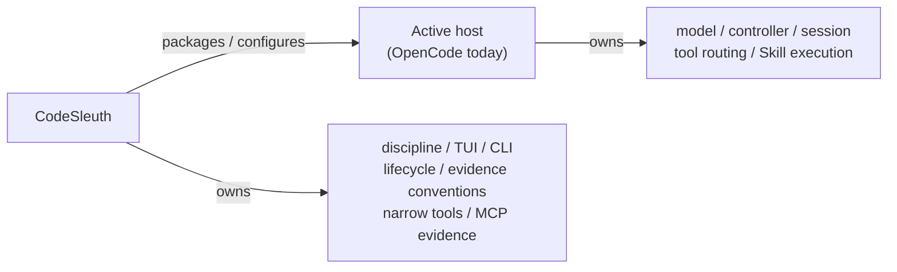
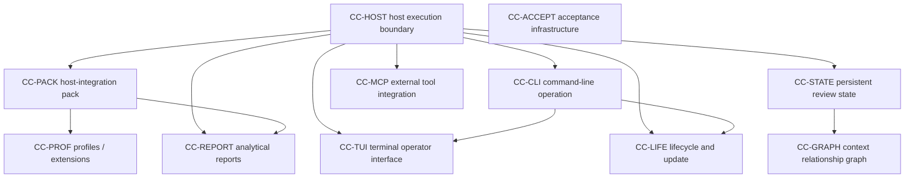
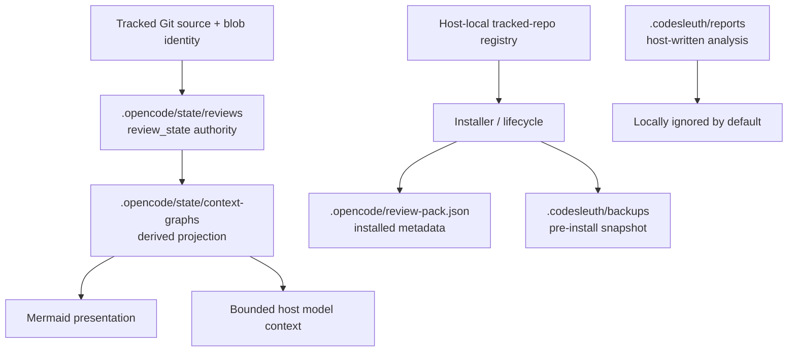
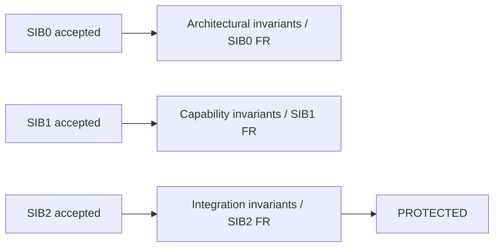

# SIB0 capability-class inventory

## Status

**Normative for the current architectural generation.**

This document freezes the fundamental capability-class inventory for CodeSleuth
as required by [`STABLE-INTEGRATION-BASELINE.md`](STABLE-INTEGRATION-BASELINE.md)
and [`EXACT-HEAD-ACCEPTANCE.md`](EXACT-HEAD-ACCEPTANCE.md).

Machine-readable contract records live in
[`protected-capabilities.json`](protected-capabilities.json). Semantics for
protection and forbidden regressions live in
[`PROTECTED-CAPABILITY-CONTRACTS.md`](PROTECTED-CAPABILITY-CONTRACTS.md).

The inventory answers:

> What fundamental kinds of capability does this architectural generation contain?

It does **not** claim SIB1 implementation completeness or SIB2 integration
completeness. Those require separate exact-head acceptance.

## Freeze rule

After this inventory is accepted at an exact SHA:

1. ordinary implementation and feature population must not add, remove, or
   redefine a fundamental capability class;
2. adding/removing/redefining a class reopens architecture and requires a
   replacement SIB0 lineage;
3. concrete commands, profiles, adapters, Skills, Playbooks, and workflows are
   **feature population** inside these classes unless they introduce a new
   authority, runtime, persistence plane, or ownership boundary.

## Host / CodeSleuth ownership boundary

CodeSleuth must **never** become a second primary controller, model runtime,
agent loop, or general-purpose tool router. See contract
`codesleuth.host-execution-authority`.

## Canonical capability-class inventory

| ID | Capability class | Owner | Architectural slot | Depends on |
| --- | --- | --- | --- | --- |
| `CC-HOST` | controller-tool-execution-boundary | Host owns execution; CodeSleuth owns the non-ownership invariant | `docs/CODESLEUTH-PRODUCT-CONTRACT.md`, `pack/.opencode/opencode.json`, commands/agents that keep `agent: build` | — |
| `CC-CLI` | command-line-operation | CodeSleuth | `install.py`, `codesleuth_project`, Verify/update CLIs, version CLI, launchers | `CC-HOST` |
| `CC-TUI` | terminal-operator-interface | CodeSleuth | `review_pack_tui_bootstrap.py` → `codesleuth_tui_runtime.py` / `codesleuth_tui.py` | `CC-HOST`, `CC-CLI` |
| `CC-LIFE` | lifecycle-and-update-management | CodeSleuth | installer, bind/unbind/uninstall, floating/source update, restart supervision | `CC-HOST`, `CC-CLI` |
| `CC-PROF` | profile-extension-system | CodeSleuth (content); host executes | `pack/.opencode/profiles/builtin/*`, `repo_profile.ts`, `/repo-profile` | `CC-HOST`, `CC-PACK` |
| `CC-PACK` | host-integration-pack | CodeSleuth packages; host executes | `pack/.opencode/{skills,commands,agents,tools,plugins,themes}` | `CC-HOST` |
| `CC-STATE` | persistent-review-state | CodeSleuth tools under `.opencode/state/` | `review_state.ts`, review-compaction plugin | `CC-HOST` |
| `CC-GRAPH` | context-relationship-graph | CodeSleuth derived projection | `repo_context_graph.ts`, `/repo-map` | `CC-HOST`, `CC-STATE` |
| `CC-REPORT` | analytical-reports-workspace | CodeSleuth owns conventions/workspace; host `build` writes bodies | `.codesleuth/reports/`, `CODESLEUTH-REPORTS.md`, reports Skill | `CC-HOST`, `CC-PACK` |
| `CC-MCP` | external-tool-integration | CodeSleuth adapter; external host retains controller | `codesleuth_mcp/`, `docs/NOVACLAW-MCP.md` | `CC-HOST` |
| `CC-ACCEPT` | acceptance-infrastructure | Maintainers / CI | `.github/workflows/acceptance.yml`, pytest/ruff, Bun smokes, registry tests | — |

### Feature population examples (not new classes)

| Class | Feature population |
| --- | --- |
| `CC-CLI` | `verify`, `update --check`, `--list`, `--bind`, `--uninstall`, `--version` |
| `CC-TUI` | Home/Review/Evidence/Tools/Settings surfaces, collapse rails, activity console |
| `CC-LIFE` | self-install, bind-dependency, purge traces, restart request marker |
| `CC-PROF` | `generic` / `rust` / `python` / `node` / `typescript` builtins |
| `CC-PACK` | individual Skills, `/repo-*` commands, plugins, themes |
| `CC-GRAPH` | relation kinds, neighborhood queries, Mermaid projection options |
| `CC-MCP` | NovaClaw or later host adapters through the same read-only evidence seam |
| `CC-ACCEPT` | additional matrix cells, focused contract tests |

### What each class must never become

| Class | Must never become |
| --- | --- |
| `CC-HOST` | a CodeSleuth-owned execution runtime |
| `CC-CLI` / `CC-TUI` | a second agent supervisor disguised as operator UX |
| `CC-LIFE` | OS/host-session reboot authority or silent pinned-dependency mutation |
| `CC-PROF` / `CC-PACK` | a permission escalator or alternate controller prompt owner |
| `CC-STATE` | host execution-state authority |
| `CC-GRAPH` | repository source authority or sole material-finding evidence |
| `CC-REPORT` | committed secret store by default or independent analysis engine |
| `CC-MCP` | write-capable or controller-replacing agent surface |
| `CC-ACCEPT` | a gate that accepts synthetic merge SHAs as exact-head proof |

## Dependency graph

## State ownership

- **Source authority:** tracked Git + blob identity.
- **Review evidence authority:** `review_state` under `.opencode/state/reviews/`.
- **Derived only:** context graphs and Mermaid.
- **Lifecycle metadata:** installed `review-pack.json` / `codesleuth.json`.
- **Reports:** OpenCode `build` writes; CodeSleuth owns folder conventions.
- **Host registry:** machine-local path list for install targeting; not project source of truth.

## SIB protection inheritance

Every contract in `protected-capabilities.json` owns its `forbidden_regressions`
ledger from creation. SIB0-origin entries encode architectural bad states that
must not return after this inventory is accepted.

## Verify / smoke ownership note

Product Verify for an installed target is
`.opencode/bin/review-pack-smoke.py` (compatibility filename).

Root `smoke.py` is a **source-checkout development helper** with a stricter
required-file list. It is not a second product Verify authority. Unifying or
explicitly cross-checking those lists is SIB1 hardening, not a new capability
class.

## Root `profiles/` note

Tracked root `profiles/*.json` fragments are **not** the active profile
mechanism. Canonical builtins live under `pack/.opencode/profiles/builtin/`.
Treating root `profiles/` as authoritative would reopen profile ownership.
Cleanup of the stale root seam is non-blocking after SIB0 freeze.

## Registry mapping

| Capability class ID | Primary contract id(s) |
| --- | --- |
| `CC-HOST` | `codesleuth.host-execution-authority` |
| `CC-CLI` | `codesleuth.cli-control-surface` |
| `CC-TUI` | `codesleuth.tui-control-feedback` |
| `CC-LIFE` | `codesleuth.install-lifecycle`, `codesleuth.update-restart` |
| `CC-PROF` | `codesleuth.profile-extension-system` |
| `CC-PACK` | `codesleuth.host-integration-pack` |
| `CC-STATE` | `codesleuth.durable-review-state` |
| `CC-GRAPH` | `codesleuth.context-graph-evidence-boundary` |
| `CC-REPORT` | `codesleuth.analytical-reports-workspace` |
| `CC-MCP` | `codesleuth.mcp-evidence-adapter` |
| `CC-ACCEPT` | `codesleuth.acceptance-infrastructure` |

## Deliberate freeze statement

Maintainers designate this inventory as the complete fundamental capability-class
set for the current CodeSleuth architectural generation. Exact-head SIB0
acceptance attaches to the commit that carries this freeze together with a
registry that maps every class to at least one contract owning SIB0-origin
forbidden regressions.
